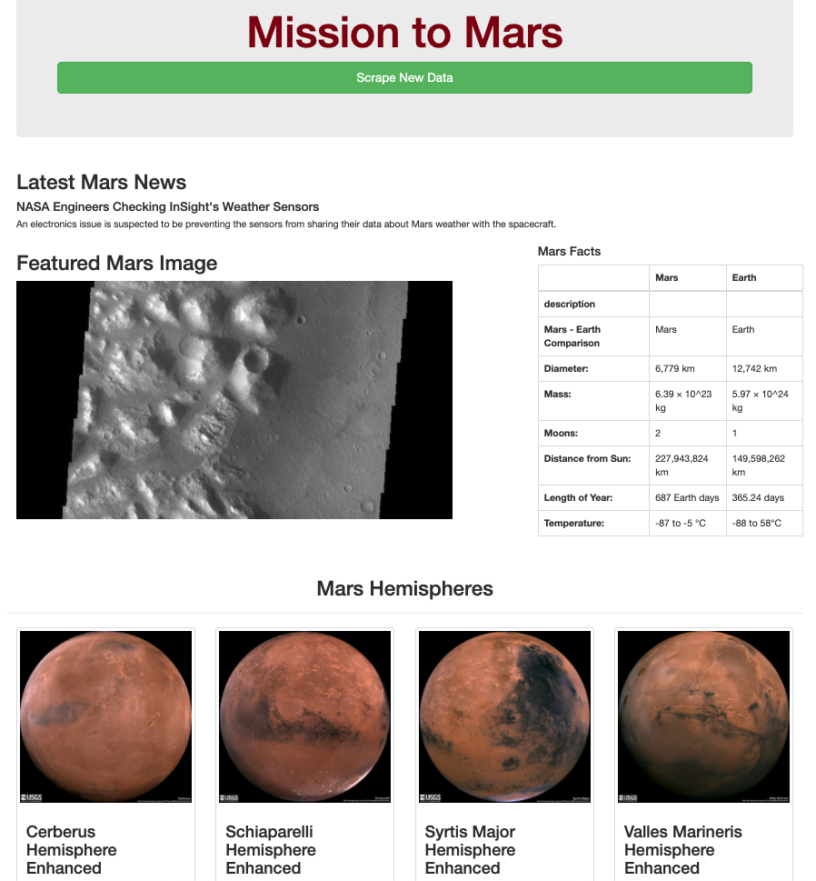

# Mission-to-Mars

## Overview
### Purpose
After creating a web app from scraped data on Mars, I was asked to adjust the current web app to include images of Mars's four hemispheres. To do this, I used BeautifulSoup and Splinter to scrape full-resolution images of Mars’s hemispheres and the titles of those images, store the scraped data on a Mongo database, use a web application to display the data, and alter the design of the web app to accommodate these images.

### Mission to Mars Web App

#### Tools used:
* Python
* HTML
